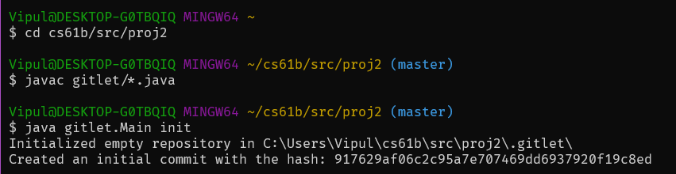
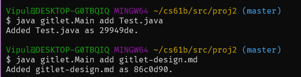
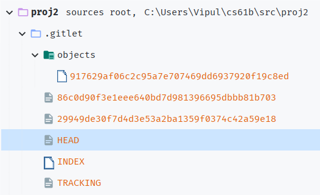
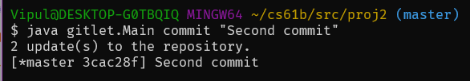
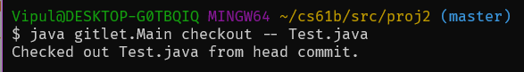
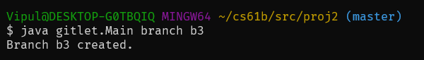
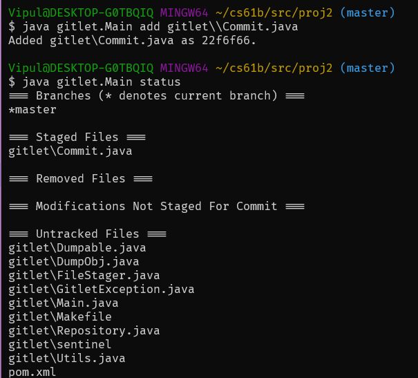
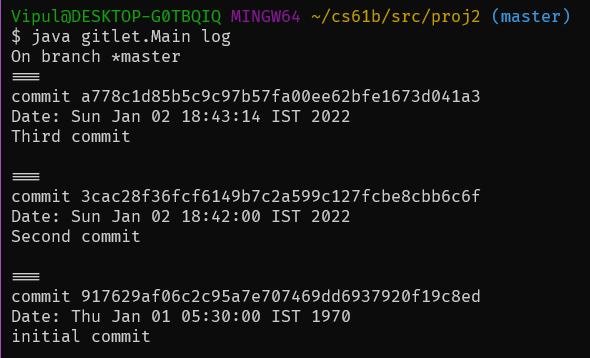

# gitlet
💻 Source Code for Berkeley's CS61B Gitlet (Spring 2021) project  

The course was not taken as part of Berkeley University's curriculum but rather self-undertaken as a skill enhancement course.

Gitlet is a command-line tool which works as a repository manager and helps in version controlling of software.  
Gitlet is just like Git (excluding some features like Git contains support for remote repositories while Gitlet does not, it is a
single source version control system). Most of the command names have been kept similar to Git.

## How to use
Clone this repository and run `javac gitlet/*.java`.  
Then to initialize a repository run `java gitlet.Main init`.  
Adding a file to be tracked and staged is as simple as `java gitlet.Main filename`.

## Screenshots
### Initialize the Gitlet repository.

### Adding a file to the staging area

### Directory Structure after adding a file

### Creating a new commit

### Checking out a file

### Creating a new branch

### Get repository status

### Get branch log

